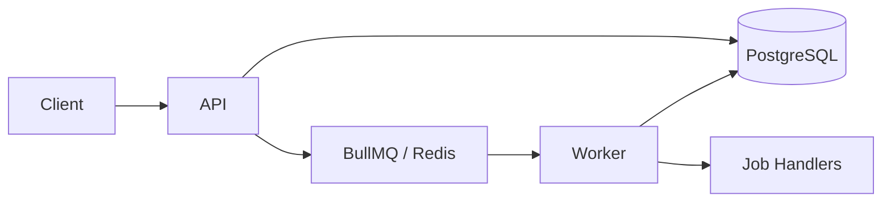
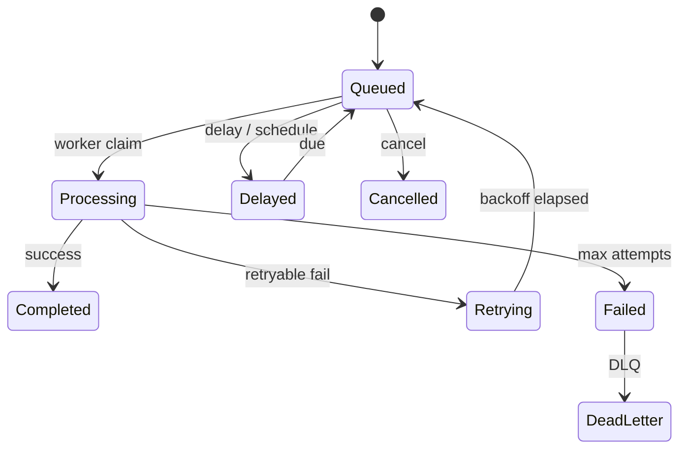

# High-Level Architecture

## 1. Goal

Establish a clean, modular NestJS architecture for an asynchronous job processing platform that:

- Satisfies all functional and non-functional requirements in `requerments.txt`
- Is production-inspired but still easy to explain in an interview
- Can grow from ~100 jobs/day → 100K → 10M+ without a rewrite

**This step produces design only.** Code scaffolding starts after approval.

---

## 2. High-Level Architecture

```
┌──────────────┐     ┌─────────────────────────────────────┐
│   Client     │────▶│  NestJS API                         │
│  (Swagger)   │     │  Auth / Validation / Jobs Controller │
└──────────────┘     └───────────┬─────────────────────────┘
                                 │
                    ┌────────────┼────────────┐
                    ▼                         ▼
             ┌─────────────┐           ┌─────────────┐
             │ PostgreSQL  │           │ Redis       │
             │ jobs table  │           │ BullMQ      │
             │ (truth)     │           │ (dispatch)  │
             └──────▲──────┘           └──────┬──────┘
                    │                         │
                    │                  ┌──────▼──────┐
                    └──────────────────│ NestJS      │
                                       │ Worker      │
                                       └─────────────┘
```

### Why each component exists

| Component | Role |
|---|---|
| **API** | Accept jobs, validate input, persist metadata, enqueue, expose queries |
| **PostgreSQL** | Source of truth for job state, retries, filtering, pagination, audit |
| **Redis + BullMQ** | Low-latency queue: claim, delay, priority, concurrency, crash recovery |
| **Worker** | Consume jobs, process, update DB, retry or move to DLQ |
| **Docker Compose** | One-command local environment matching production topology |

### Data flow (API → Queue → Worker → Database)

1. Client calls `POST /jobs` with payload (+ optional idempotency key).
2. API validates DTO (class-validator).
3. API inserts a row in PostgreSQL via Sequelize-TypeScript (`status = queued`).
4. API enqueues the job in BullMQ (prefer same id as DB primary key).
5. Worker claims the job → updates DB to `processing`.
6. Handler runs:
   - Success → `completed`
   - Retryable failure → `retrying` → back to queue with backoff
   - Max attempts exceeded → `failed` / Dead Letter Queue
7. `GET /jobs/:id` and `GET /jobs` read **PostgreSQL** (not Redis) for stable filtering and pagination.



---

## 3. Design Decisions & Tradeoffs

### Why BullMQ (not a custom Redis queue)?

| Custom Redis lists/ZSETs | BullMQ |
|---|---|
| Full control, good learning exercise | Proven delayed jobs, retries, locks, concurrency |
| Easy to get wrong under worker crash | Battle-tested patterns (Sidekiq-like) |
| Weeks of work for visibility timeout, DLQ, priority | Assignment-ready in days |

**Decision:** Use **BullMQ** for the hot path. Building a custom queue is interview theater unless the brief forbids libraries.

### Why PostgreSQL **and** Redis?

| Store | Responsibility |
|---|---|
| **PostgreSQL** | Durable job metadata, status, list/filter APIs, idempotency |
| **Redis / BullMQ** | Fast dispatch, worker coordination, delayed/priority queues |

This mirrors real systems: SQS/Kafka for transit, a DB for the control plane.

### Why Sequelize-TypeScript (not Prisma / TypeORM)?

| Option | Pros | Cons |
|---|---|---|
| **Prisma** | Excellent DX, migrations | Different mental model from classic ORMs |
| **TypeORM** | Nest docs often use it | Decorator/Active Record patterns can get messy |
| **Sequelize-TypeScript** | Familiar Sequelize ecosystem, strong typing via decorators, solid Nest integration | Migrations need Sequelize CLI or umzug; JSONB typing needs care |

**Decision:** Use **sequelize-typescript** as requested.

Why it fits this project:

- Decorators map cleanly to NestJS DI (`@Injectable()` models/repos)
- PostgreSQL enums, JSONB, indexes are first-class
- Repository pattern stays straightforward (`JobsRepository` wrapping the model)
- Easy to justify in interviews if you already know Sequelize

**Tradeoff:** We own migration discipline (umzug / sequelize-cli). That is acceptable and production-realistic.

### Delivery semantics

- Guarantee: **at-least-once** (same class as SQS, Sidekiq, BullMQ).
- Handlers must be **idempotent**.
- Exactly-once across API + queue + worker is **not** the design goal.

### Dual write (DB then queue)

Practical for Phase 1–2 of this assignment:

1. Insert job in Postgres  
2. Enqueue in BullMQ  

**Known gap:** If enqueue fails after insert, job is stuck in `queued` without a Redis message.

**Production upgrade (later, not Step 1):** transactional **outbox** pattern. Mention in interviews; do not overbuild now.

### Why separate API and Worker processes?

| Concern | Separate processes |
|---|---|
| Scale | API on RPS; workers on queue depth |
| Failure isolation | Worker crash does not take down HTTP |
| Deploy | Independent rollouts and concurrency tuning |

Same shared Nest modules; two entrypoints (`apps/api`, `apps/worker`).

---

## 4. Project Structure

Pragmatic NestJS modular layout — clean layers without a mega Clean Architecture folder tree.

```
async-job-process/
├── apps/
│   ├── api/src/                 # HTTP entry (main.ts)
│   └── worker/src/              # Worker entry (main.ts) — no HTTP server
├── libs/                        # shared Nest libraries (@app/*)
│   ├── config/                  # typed env configuration
│   ├── common/                  # filters, interceptors, correlation IDs
│   ├── database/                # sequelize-typescript 
│   ├── jobs/                    # job domain + enums (models/DTOs later)
│   ├── queue/                   # BullMQ boundary (producer/processor later)
│   ├── health/                  # /api/health, live, ready
│   └── metrics/                 # /api/metrics stub
├── docker/
│   ├── docker-compose.yml
│   ├── api.Dockerfile
│   └── worker.Dockerfile
├── docs/                        # step-by-step design notes
├── .env.example
└── package.json                 # npm scripts for api/worker/docker
```

### Why each folder exists

| Path | Purpose |
|---|---|
| `apps/api` | Deployable HTTP service; scale on request rate |
| `apps/worker` | Deployable consumer; scale on backlog |
| `libs/jobs` | Job lifecycle in DB (CRUD, status, idempotency) |
| `libs/queue` | BullMQ wiring only — keep queue concerns isolated |
| `libs/common` | Centralized errors, logging, correlation IDs |
| `libs/config` | Typed env (`QUEUE_CONCURRENCY`, DB, Redis) |
| `libs/database` | Sequelize connection, models, migrations (Step 2) |
| `libs/health` / `metrics` | `/api/health`, `/api/metrics` |
| `docker/` | Compose for API + Worker + Postgres + Redis |
| `docs/` | Architecture and step explanations for review |

**Note:** Nest monorepo uses `libs/` (imported via `@app/*`) instead of a root `src/`. Same modular intent; better CLI/path support.

**Rejected:** Dumping API + worker + domain into one flat `src/modules` with no process split — works for tutorials, fails when you need independent scaling.

---

## 5. Database Design (preview — detailed in Step 2)

```text
jobs
  id              UUID PK
  idempotency_key TEXT UNIQUE NULL
  type            TEXT              -- handler / job type name
  payload         JSONB
  status          ENUM(...)
  priority        INT DEFAULT 0
  attempts        INT DEFAULT 0
  max_attempts    INT DEFAULT 3
  available_at    TIMESTAMPTZ       -- delayed / scheduled
  last_error      TEXT NULL
  created_at      TIMESTAMPTZ
  updated_at      TIMESTAMPTZ
  completed_at    TIMESTAMPTZ NULL
```

Useful indexes (Step 2):

- `(status, created_at)` — list + filter
- unique `(idempotency_key)` — safe retries from clients
- partial indexes on active statuses — keep hot paths small

**Why JSONB for payload?** Flexible job inputs without schema churn per job type; index later with GIN if filtering on payload becomes necessary.

---

## 6. Queue / Job Lifecycle



| Concern | Approach |
|---|---|
| Retry | BullMQ attempts + exponential backoff; mirror counters in Postgres |
| Priority | BullMQ priority + `priority` column for API visibility |
| Delayed / scheduled | BullMQ `delay` + `available_at` |
| Multiple workers | BullMQ job locks; run N worker replicas |
| Crash recovery | Lock expires → job becomes available again |
| Idempotency | Unique `idempotency_key`; do not re-enqueue completed jobs |
| Duplicate processing | Same BullMQ job id as DB id + status guard before work |

---

## 7. Scope Map vs Requirements

| Requirement | Target step |
|---|---|
| Architecture + folder layout + Docker stubs |
| Sequelize-TypeScript models, migrations, indexes |
| Create / Get / List APIs, validation, Swagger |
| BullMQ + worker + retries + status updates |
| DLQ, delayed, priority, pause/resume, scheduled |
| Health, metrics, structured logging |
| Rate limiting, JWT, concurrency config |
| Idempotency keys |
| Tests (unit / integration / lifecycle) | Alongside each feature step |

---

## 8. Scalability Story (today → tomorrow)

| Layer | Phase 1 (100/day) | Phase 2 (100K/day) | Phase 3 (10M+/day) |
|---|---|---|---|
| Queue | Single Redis + BullMQ | Redis Sentinel/Cluster; more workers | Swap to SQS/Kafka behind a thin `QueuePort` |
| DB | Single Postgres + Sequelize | Read replica for list APIs; archive completed jobs | Partition by time/tenant |
| API | 1 replica | N behind load balancer + rate limits | API gateway + per-tenant quotas |
| Workers | 1 container, concurrency via config | HPA on queue depth | Multi-region consumers |

**Bottlenecks called out early:**

1. Listing millions of completed jobs from one table → archive / partition.
2. Large payloads in Redis → store payload in Postgres (or object storage), pass only job id on the queue.
3. Dual-write races → outbox when reliability SLOs tighten.


## 9. Production Improvements (later)

- Transactional outbox for enqueue-after-commit
- OpenTelemetry traces + Prometheus histograms (p95 latency)
- Payload size limits + object-storage offload
- Per-tenant fair scheduling and rate limits
- Chaos tests: kill worker mid-job and assert recovery

---

## 10. Stack Decisions Locked in Step 1

| Choice | Decision |
|---|---|
| Runtime | NestJS + TypeScript |
| Queue | BullMQ on Redis |
| Database | PostgreSQL |
| ORM | **sequelize-typescript** |
| Layout | `apps/api` + `apps/worker` + shared `libs/*` (`@app/*`) |
| Package manager | **npm** (lockfile committed; pnpm optional later) |
| Local ops | Docker Compose (API, Worker, Postgres, Redis) |
| Docs | Step explanations in `docs/STEP-XX-*.md` |

---

## 11. Scaffold delivered

- Nest monorepo with `api` + `worker` entrypoints
- Shared libs: config, common, database, jobs, queue, health, metrics
- Swagger scaffolded at `/docs`
- Health + metrics stub endpoints
- Docker Compose + Dockerfiles
- `.env.example` / `.env`
- `npm run build:api` and `npm run build:worker` succeed

---
